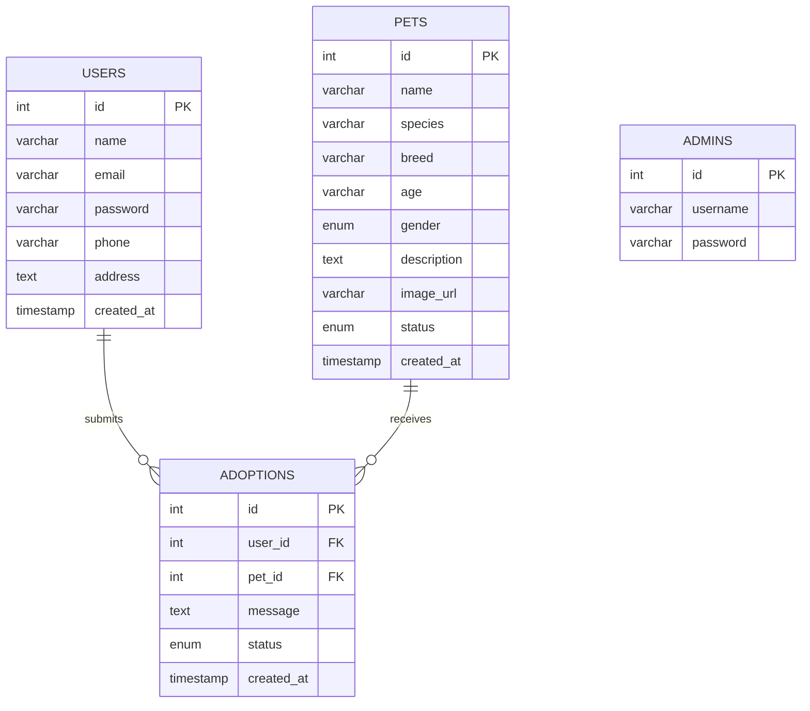

# PAW_HOMES_PET_ADOPTION_SYSTEM

PawHome is a web-based pet adoption platform that connects animals in need with loving families. Users can browse available pets, submit adoption requests, and track their request status — all through a clean and simple interface.

---

## ✨ Features

### 👤 User Side
- **Register & Login** — Create an account and log in securely
- **Browse Pets** — View all available pets with photos, species, breed, age, and gender
- **Search & Filter** — Filter pets by species or search by name/breed
- **Pet Details** — View full details of each pet
- **Request Adoption** — Submit an adoption request with a personal message
- **My Requests** — Track the status of all submitted adoption requests

### 🛠️ Admin Side
- **Admin Dashboard** — Manage all pets and adoption requests
- **Add / Edit / Delete Pets** — Full control over pet listings
- **Approve or Reject Requests** — Review and respond to adoption applications
- **User Management** — View registered users

---

## 🗄️ ER Diagram

---

## 🛠️ Built With

- **Backend:** PHP (PDO)
- **Database:** MySQL
- **Frontend:** HTML, CSS
- **Local Server:** XAMPP

---

*🐾 PawHome — Helping pets find loving homes.*
